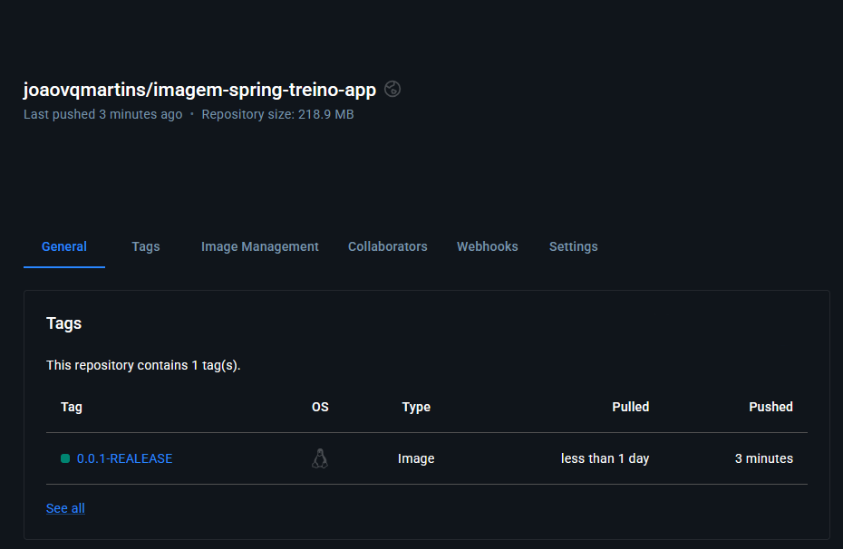

# DockerTraining

Projeto desenvolvido como atividade prática do curso **"Batismo de Docker - Um Curso de Docker do Zero"**, ministrado por Horácio Fiasco.

## Objetivo

O objetivo deste projeto foi compreender os conceitos fundamentais do Docker através da conteinerização de uma aplicação Java Spring Boot simples.

A aplicação disponibiliza um endpoint HTTP para validar o funcionamento da aplicação dentro de um container Docker.

## Tecnologias Utilizadas

- Java 17
- Spring Boot
- Maven
- Docker
- Docker Hub

## Estrutura do Projeto

```text
src
└── main
    ├── java
    │   └── br.com.dev.DockerTraining
    │       ├── controller
    │       │   └── DockerController.java
    │       └── DockerTrainingApplication.java
    │
    └── resources
        └── application.yml
```

## Funcionalidade

Ao acessar o endpoint:

```http
GET /docker
```

A aplicação retorna:

```text
🐳 Docker rodou com sucesso!
```

Essa resposta confirma que a aplicação Spring Boot foi iniciada corretamente dentro de um container Docker.

## Imagem Publicada

### Docker Hub

Repositório:

```text
joaovqmartins/imagem-spring-treino-app
```

Tag:

```text
0.0.1-RELEASE
```

Digest:

```text
sha256:63428f9b90a2ca8bdba5b8db56ca4c3957489a499cd0be1c6aa1001f63ae91e9
```

## Executando a Aplicação

### Baixar a imagem

```bash
docker pull joaovqmartins/imagem-spring-treino-app:0.0.1-RELEASE
```

### Executar o container

```bash
docker run -p 8080:8080 joaovqmartins/imagem-spring-treino-app:0.0.1-RELEASE
```

### Acessar a aplicação

```text
http://localhost:8080/docker
```

## Comandos Utilizados Durante o Treinamento

### Construção da imagem

```bash
docker build -t imagem-spring-treino:0.0.1-RELEASE .
```

### Criação da tag para publicação

```bash
docker tag imagem-spring-treino:0.0.1-RELEASE joaovqmartins/imagem-spring-treino-app:0.0.1-RELEASE
```

### Publicação da imagem

```bash
docker push joaovqmartins/imagem-spring-treino-app:0.0.1-RELEASE
```

### Verificação das imagens locais

```bash
docker images
```

### Execução de containers

```bash
docker run -p 8080:8080 joaovqmartins/imagem-spring-treino-app:0.0.1-RELEASE
```

### Listagem de containers ativos

```bash
docker ps
```

### Listagem de todos os containers

```bash
docker ps -a
```

### Visualização de logs

```bash
docker logs <container-id>
```

Exemplo:

```bash
docker logs d89a
```

### Parada de containers

```bash
docker stop <container-id>
```

Exemplo:

```bash
docker stop d89a
```

### Comandos auxiliares utilizados

```bash
clear
ls
cd
```

## Aprendizados

Durante a realização deste treinamento foram praticados os seguintes conceitos:

- Instalação e utilização do Docker
- Criação de imagens Docker
- Construção de containers
- Exposição de portas
- Execução de aplicações Spring Boot em containers
- Gerenciamento de containers
- Consulta de logs
- Publicação de imagens no Docker Hub
- Versionamento de imagens
- Utilização do Maven para empacotamento da aplicação

## Resultado Final

Ao término do treinamento foi possível:

- Criar uma aplicação Spring Boot funcional
- Gerar uma imagem Docker da aplicação
- Executar a aplicação dentro de um container
- Publicar a imagem no Docker Hub
- Compartilhar a aplicação através de uma imagem versionada

## Evidências

### Repositório publicado no Docker Hub

A imagem foi publicada com sucesso no Docker Hub utilizando a tag:

```bash
joaovqmartins/imagem-spring-treino-app:0.0.1-RELEASE
```



## Referência

**Curso:** Batismo de Docker - Um Curso de Docker do Zero

**Instrutor:** Horácio Fiasco

**Plataforma:** Udemy
